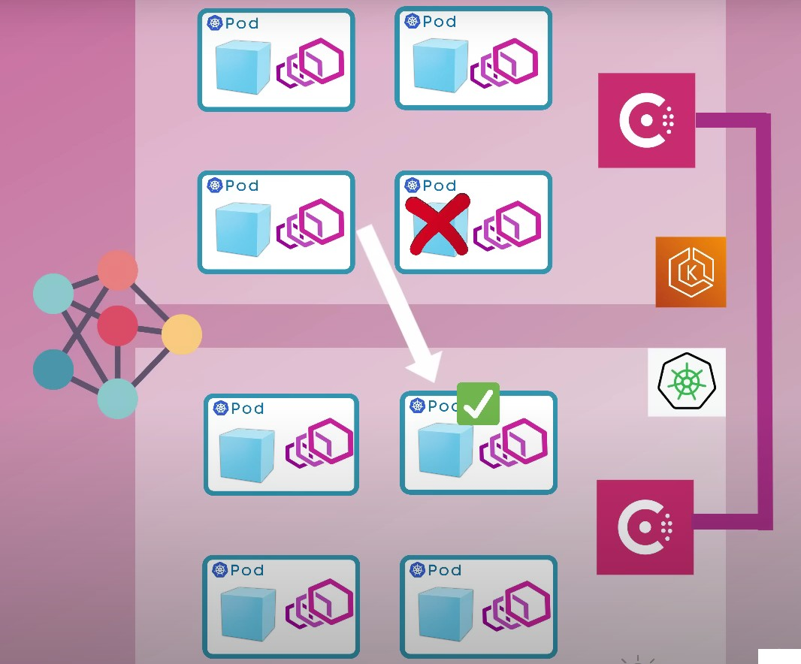
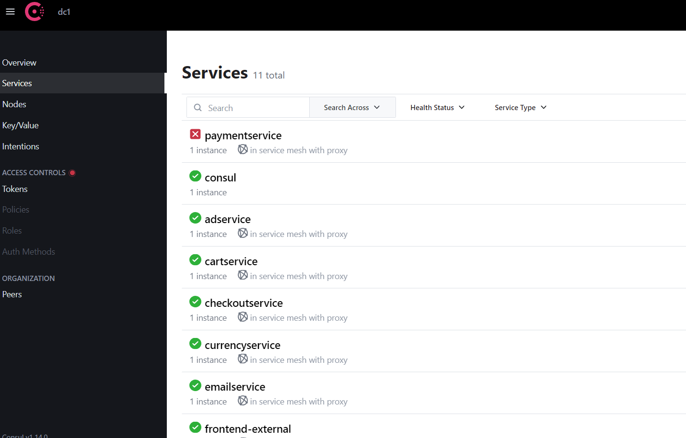

# k8s-multi-cluster-microservices
This repository contains the implementation of scalable microservices architecture utilizing Consul Service Mesh for achieving multi-cluster failover in Kubernetes API and multi-cloud environments. 

The project demonstrates how to architect microservices for resilience across different regions and cloud providers, leveraging Consul for service discovery, load balancing, and failover management. The repository includes code samples, configurations, and documentation for setting up and deploying microservices using Consul service mesh.

Project Step By Step:
1. Make sure to run kubernetes deployment and consul in same namespace. 

